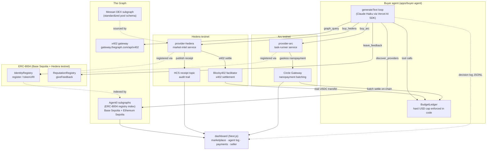

# Architecture

Agent Bazaar is a two-sided agent economy: providers sell x402-gated services
and prove their identity on-chain; a buyer agent discovers them through The
Graph, ranks them, pays across whichever rail they use, and leaves feedback
that improves the next buyer's ranking.

## System diagram

## Payment rails at a glance

| Rail | Chain | Settlement | Used for |
|---|---|---|---|
| Hedera x402 | Hedera testnet | Blocky402 facilitator, real USDC (HTS token `0.0.429274`) transfer per call | Market-intel risk briefs |
| Arc Nanopayments | Arc testnet | Circle Gateway, gas-free batched settlement | Task-runner summarise / classify-risk |
| Graph x402 | Base Sepolia | `gateway.thegraph.com/api/x402`, pay-per-query | Ad-hoc subgraph queries (currently blocked by an upstream client library bug — see [docs/STATUS.md](STATUS.md#wp06-buyer-agent)) |

## Identity and discovery loop

1. A provider registers on the ERC-8004 `IdentityRegistry` (Base Sepolia, and
   Hedera testnet for the Hedera-extra-credit path) with a `tokenURI` pointing
   at a public registration file (`registrations/*.json` in this repo).
2. The Graph's Agent0 subgraph indexes the `Registered` event and (eventually)
   crawls the tokenURI to populate `registrationFile` — rail, price catalog
   pointer, `x402Support`.
3. The buyer agent's `discover_providers` tool queries Agent0 across both
   chains in one GraphQL document, hydrates each listing against the
   provider's own live `/catalog`, and ranks by price / reputation /
   validation count.
4. After a purchase, the buyer calls `giveFeedback` on the ERC-8004
   `ReputationRegistry`, which the same subgraph indexes — so the next
   buyer's ranking reflects what actually happened.

## Real evidence

Every claim above is backed by a real testnet transaction or query recorded
in [docs/STATUS.md](STATUS.md), not a mock run. Highlights:

- Real Hedera x402 settlement: [mirror node](https://testnet.mirrornode.hedera.com/api/v1/transactions/0.0.7162784-1788723378-172223383)
- Real HCS receipt topic: [`0.0.10395241`](https://testnet.mirrornode.hedera.com/api/v1/topics/0.0.10395241/messages)
- Real Arc nanopayment + withdrawal: [mint tx](https://sepolia.basescan.org/tx/0x1d182bc9c38484976ba234a14be310a8a0f9502e938dde8a98ff8ff9254d239a)
- Real ERC-8004 registrations: agentId `9179` ([Base Sepolia](https://sepolia.basescan.org/tx/0x7c489b270f2eb9056015319785c1cc9a678274a5391d00729006866f53075f3c), [Hedera testnet](https://hashscan.io/testnet/transaction/0x1d7bb528de3dd7d0fc12c3ddc2a72f6dbb764000c5938b0c527b6f0ae4a5d521)), agentId `9180` ([Base Sepolia](https://sepolia.basescan.org/tx/0x5ddf8d1cbe60641a881d56a101db731f4c2a102efdca181bc7442176a5f7e2a8))
- Real end-to-end buyer transcript: [`docs/demo/transcript-2026-09-06.md`](demo/transcript-2026-09-06.md)
